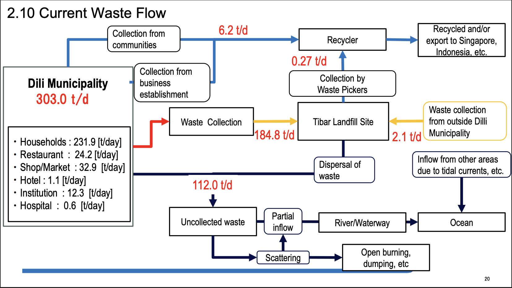
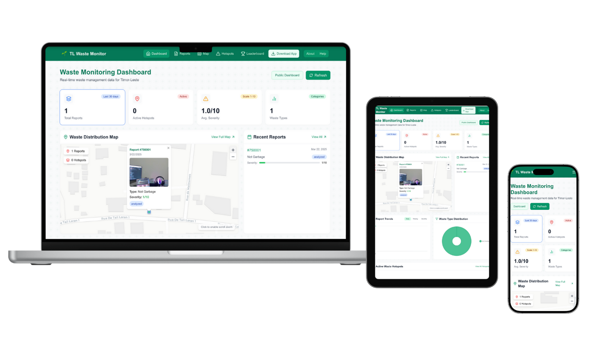

# TL Digital Waste Monitoring Network

<div align="center">


<br>


**AI-Powered Waste Management System for Timor-Leste**

<a href="https://tlwaster.site" target="_blank">Live Dashboard Demo</a> •
<a href="https://drive.google.com/drive/folders/1O2CP7oY6aVZOTpRaTXd6RO8T1DjITV4p" target="_blank">Mobile App Download</a>

</div>

## 🌟 Overview

The **TL Digital Waste Monitoring Network** is a comprehensive AI-powered system addressing Timor-Leste's waste management challenges through a network of intelligent agents. By leveraging the Fetch.ai Agentverse platform and ASI-1 Mini's multimodal AI capabilities, our solution enables citizens to report waste issues via a mobile app, provides authorities with actionable insights through an analytical dashboard, and facilitates data-driven decision-making for waste management authorities.

### 🤖 AI Agents on Agentverse

<div align="center">
  <b>📝 Reporting Agent</b>  
  <br>
  <a href="https://agentverse.ai/agents/details/agent1q274qa27j4lxzrj8zn3rerd9c93e7a4y0ms5vfjtwlswrv5knxz7gp5twla">
    agent1q274qa27j4lxzrj8zn3rerd9c93e7a4y0ms5vfjtwlswrv5knxz7gp5twla
  </a>
  <br><br>
  <b>📊 Analysis Agent</b>  
  <br>
  <a href="https://agentverse.ai/agents/details/agent1qd4r764zmlp0rfh04s08km9v5sh3wvrjl06pm20ckfkltkqtww9jzrlanke">
    agent1qd4r764zmlp0rfh04s08km9v5sh3wvrjl06pm20ckfkltkqtww9jzrlanke
  </a>
</div>

## 🚩 The Problem: Waste Management in Timor-Leste

Timor-Leste, particularly Dili Municipality, faces significant waste management challenges:

- **303 tons of waste generated daily** with limited collection coverage
- **112 tons of uncollected waste daily** often ending up in waterways and oceans
- **Inefficient monitoring systems** making it difficult to target problem areas
- **Limited citizen engagement** in the waste management process
- **Flooding issues** during heavy rainfall due to waste clogging drainage systems - https://www.youtube.com/watch?v=2D1AoKoEOr4

- **Marine ecosystem damage** from plastic waste entering oceans


_Source: [JICA Dili Solid Waste Management Presentation](https://www.jica.go.jp/english/overseas/easttimor/data/__icsFiles/afieldfile/2024/11/30/Dili_SWM_Presentation_Material_English_2.pdf), page 20_

Our solution addresses these challenges by creating a digital infrastructure that engages citizens, optimizes waste collection efforts, and provides data-driven insights for authorities.

## 🔑 Key Solutions

1. **Community-Powered Waste Reporting**

   - Mobile app for citizens to report waste issues with photos and location
   - AI verification to ensure report legitimacy
   - Gamification elements to encourage participation

2. **AI-Powered Waste Classification**

   - ASI-1 Mini integration for multimodal waste image analysis
   - Automatic classification of waste types (plastic, organic, metal, etc.)
   - Severity assessment with environmental impact evaluation

3. **Hotspot Detection System**

   - Spatial clustering algorithm to identify waste accumulation patterns
   - Prioritization of areas based on severity and report frequency
   - Predictive models for potential problem areas

4. **Interactive Public Dashboard**
   - Real-time visualization of waste distribution
   - Analytics for authorities to track progress and metrics
   - Transparency in waste management efforts

## 🏗️ System Architecture

Our system follows a modular agent-based architecture with components designed to work together while remaining independently scalable:

```mermaid
graph TD
    %% Define main sections with subgraphs
    subgraph Citizens["Citizen Layer"]
        MobileApp["Mobile Application<br/>(Flutter)"]
    end

    subgraph AgentverseLayer["Agentverse Platform"]
        Registry["Agent Registry"]
        Discovery["Agent Discovery"]
        Messaging["Message Routing"]
    end

    subgraph AgentNetwork["AI Agent Network"]
        ReportingAgent["Reporting Agent<br/>(Fetch.ai SDK)"]
        AnalysisAgent["Analysis Agent<br/>(Fetch.ai SDK)"]
    end

    subgraph BackendInfrastructure["Storage & Data Infrastructure"]
        DB[(MySQL Database)]
        S3["AWS S3 Storage"]
    end

    subgraph APIServices["API Services"]
        FlaskAPI["API Service<br/>(Flask)"]
        NextAPI["Dashboard API<br/>(Next.js API Routes)"]
        Auth["JWT Authentication"]
    end

    subgraph DashboardLayer["Visualization Layer"]
        Dashboard["Public Dashboard<br/>(Next.js)"]
        Maps["Interactive Maps<br/>(Leaflet)"]
        Analytics["Analytics Dashboard<br/>(Tremor + Chart.js)"]
    end

    subgraph ExternalSystems["External Systems"]
        ASI["ASI-1 Mini LLM"]
        EmailService["Email Service<br/>(SMTP)"]
        WasteService["Waste Management<br/>Services"]
    end

    %% Define connections between components
    MobileApp -->|"Submit Reports<br/>JWT Auth"| FlaskAPI
    MobileApp -->|"View Reports<br/>& Hotspots"| Dashboard

    FlaskAPI -->|"Store Report<br/>Metadata"| DB
    FlaskAPI -->|"User Authentication"| Auth
    FlaskAPI -->|"Store Images"| S3
    FlaskAPI -->|"Notify About Reports"| ReportingAgent

    NextAPI -->|"Read Data"| DB
    Dashboard -->|"Request Data"| NextAPI
    Maps -->|"Load Geospatial<br/>Data"| NextAPI
    Analytics -->|"Fetch Statistics"| NextAPI

    ReportingAgent -->|"Register"| Registry
    AnalysisAgent -->|"Register"| Registry
    ReportingAgent -->|"Discover"| Discovery
    ReportingAgent -->|"Notify About New<br/>Reports with Images"| AnalysisAgent
    AnalysisAgent -->|"Update Report Status"| ReportingAgent

    ReportingAgent -->|"Update Report<br/>Status"| DB
    AnalysisAgent -->|"Retrieve<br/>Images"| S3
    AnalysisAgent -->|"Process Images<br/>with Vision AI"| ASI
    AnalysisAgent -->|"Store Analysis<br/>Results"| DB

    FlaskAPI -->|"Send Verification<br/>Emails"| EmailService
    NextAPI -->|"Recommend<br/>Cleanup Tasks"| WasteService

    %% Define styles
    classDef mobileStyle fill:#f9d6ff,stroke:#9c27b0,stroke-width:2px;
    classDef agentStyle fill:#d4f1f9,stroke:#0bb5e2,stroke-width:2px;
    classDef backendStyle fill:#d8f3d8,stroke:#4CAF50,stroke-width:2px;
    classDef dashboardStyle fill:#f9e7d2,stroke:#ff9800,stroke-width:2px;
    classDef externalStyle fill:#f5f5f5,stroke:#9e9e9e,stroke-width:2px;
    classDef agentverseStyle fill:#e1d1f6,stroke:#673ab7,stroke-width:2px;
    classDef apiStyle fill:#ffe9ed,stroke:#e91e63,stroke-width:2px;

    %% Apply styles
    class MobileApp mobileStyle;
    class ReportingAgent,AnalysisAgent agentStyle;
    class DB,S3 backendStyle;
    class Dashboard,Maps,Analytics dashboardStyle;
    class ASI,EmailService,WasteService externalStyle;
    class Registry,Discovery,Messaging agentverseStyle;
    class FlaskAPI,NextAPI,Auth apiStyle;
```



### 1. Mobile Application (Citizen Interface)

- **Flutter-based cross-platform app** optimized for Android devices
- **Offline capability** for areas with limited connectivity in Timor-Leste
- **Low bandwidth optimization** with compressed image uploads
- **Gamification** with community leaderboards to encourage participation
- **Geolocation services** for precise waste location tagging
- **Real-time status updates** for submitted reports

### 2. AI Agent Network (Core Processing)

- **Reporting Agent**: Handles intake of citizen reports, manages S3 uploads, and orchestrates data flow
- **Analysis Agent**: Processes images using ASI-1 Mini for waste classification and severity assessment
- **Agent Communication**: Secured message passing through the Agentverse platform
- **Smart Processing Queue**: Prioritizes analysis tasks based on urgency and location
- **Hotspot Detection Algorithm**: Spatial clustering with adaptive radius based on population density

### 3. Backend Infrastructure

- **MySQL Database**: Optimized schema for waste reports, analysis results, and hotspots
- **AWS S3**: Hierarchical storage with date-based organization and efficient compression
- **REST API**: Secure endpoints with rate limiting and input validation
- **JWT Authentication**: Role-based access control with secure refresh token mechanism
- **Email Service**: OTP verification and status notifications
- **Geospatial Extensions**: Optimized queries for location-based data retrieval

### 4. Public Dashboard (Visualization)

- **Next.js Web Application**: Server-side rendering for performance and SEO
- **Interactive Maps**: Clustering, heatmaps, and time-series visualization
- **Analytics Dashboard**: Customizable metrics with export capabilities
- **Multi-stakeholder Views**: Role-based interfaces with appropriate access levels
- **Responsive Design**: Full functionality on desktop, tablet, and mobile devices
- **Performance Optimization**: Data caching and incremental static regeneration

## 🧠 AI and Technical Capabilities

### Multimodal AI Analysis with ASI-1 Mini

Our system leverages ASI-1 Mini's advanced capabilities to:

1. **Verify Waste in Images**: First determines if an image actually contains waste
2. **Classify Waste Types**: Identifies specific categories (plastic, organic, etc.)
3. **Assess Severity**: Rates issues on a scale of 1-10 based on multiple factors
4. **Generate Detailed Descriptions**: Creates comprehensive scene descriptions for authorities

Example analysis results:

```json
{
  "waste_type": "Plastic",
  "severity_score": 8,
  "priority_level": "high",
  "environmental_impact": "Water contamination risk due to proximity to drainage",
  "estimated_volume": "2.5 cubic meters",
  "safety_concerns": "Sharp objects present",
  "short_description": "Plastic waste accumulation near drainage",
  "full_description": "The image shows a significant accumulation of plastic waste blocking a drainage channel. Various plastic containers, bags, and packaging materials are scattered along the drainage path. This poses an immediate flooding risk during rainfall and water contamination hazard."
}
```

### Hotspot Detection Algorithm

Our spatial clustering algorithm identifies waste hotspots using:

1. **Proximity Analysis**: Groups reports within 500m radius
2. **Frequency Weighting**: Prioritizes areas with multiple reports over time
3. **Severity Enhancement**: Factors in AI-assessed severity scores
4. **Temporal Patterns**: Identifies recurring issues vs. one-time problems

## 📱 Components and Repositories

Our solution is divided into four repositories, each handling a specific aspect of the system:

### 1. [TL Waste Report App](https://github.com/ajitonelsonn/tl_waste_report)

The mobile application for citizens to report waste issues, built with Flutter.

<div align="center">
  
</div>

- **Report Submission**: Photo capture, GPS location, and description input
- **Report History**: Track status and view analysis results
- **Interactive Map**: Explore nearby reports and hotspots

### 2. [TL Waste Monitoring Backend](https://github.com/ajitonelsonn/tl-waste-monitoring)

Backend systems including AI agents, API services, and database integration.

- **Reporting Agent**: Handles report intake, image storage, and communication
- **Analysis Agent**: Processes images with ASI-1 Mini for waste classification
- **API Service**: Manages authentication, user data, and report access
- **Database Models**: Structured data storage with optimized queries

### 3. [TL Waste Dashboard](https://github.com/ajitonelsonn/tl-waste-dashboard)

Web interface for visualization and analysis of waste management data.

<div align="center">
  
</div>

- **Interactive Map**: Geospatial visualization of reports and hotspots
- **Analytics Dashboard**: Key metrics and trend visualization
- **Resource Allocation Tools**: Optimization suggestions for cleanup efforts
- **Community Leaderboard**: Recognition for active contributors

### 4. [TL Digital Waste Monitoring Network](https://github.com/ajitonelsonn/TLWasteR) (This Repo)

Main repository with overall project documentation, system architecture, and integration guides.

## 💡 Innovation & Impact

### Technological Innovation

- **AI Agent Orchestration**: Leveraging Agentverse for seamless agent communication
- **Multimodal Analysis**: Using ASI-1 Mini for complex image understanding
- **Edge-Optimized Mobile App**: Functioning in low-connectivity environments
- **Spatial Intelligence**: Advanced hotspot detection algorithms

### Social Impact for Timor-Leste

- **Citizen Empowerment**: Engaging communities in environmental stewardship
- **Data-Driven Decisions**: Enabling authorities to prioritize cleanup efforts
- **Environmental Protection**: Reducing waste in waterways and marine environments
- **Infrastructure Protection**: Preventing drainage blockages that cause flooding
- **Public Health Improvement**: Reducing health hazards from waste accumulation

## 🚀 Future Development Roadmap

### Phase 1: Launch & Validation

- Mobile app rollout in selected communities in Dili
- System refinement based on initial user feedback
- Development of community champions program
- Partnership with local waste management authorities

### Phase 2: Expansion & Enhancement

- Geographic expansion to all of Dili Municipality
- Addition of a **Collection Agent** to coordinate cleanup efforts
- Integration with waste management contractor systems
- Enhanced analytics with predictive modeling

### Phase 3: Sustainability & Scale

- National rollout across Timor-Leste
- Development of specialized waste collection mobile app
- Implementation of automated cleanup task prioritization
- Integration with broader environmental monitoring systems
- Commercial model development for long-term sustainability

## 🔄 Data Flow & Process

1. **Citizen Reports Waste**

   - User captures photo, GPS location, and description
   - App validates and uploads data with low-bandwidth optimization

2. **Reporting Agent Processes Report**

   - Securely stores image in AWS S3
   - Records metadata in database
   - Queues for analysis if image is present

3. **Analysis Agent Evaluates Waste**

   - Processes image with ASI-1 Mini
   - Classifies waste type and assesses severity
   - Identifies potential environmental impacts
   - Updates database with analysis results

4. **Hotspot Detection**

   - Spatial algorithm checks for nearby reports
   - Creates or updates hotspot records when clusters are found
   - Calculates priority levels based on severity and frequency

5. **Dashboard Visualization**

   - Displays real-time data on interactive maps
   - Updates analytics and statistics
   - Provides actionable insights for authorities

6. **Authority Response**
   - Officials use data to prioritize cleanup efforts
   - Update report status when addressed
   - Citizens receive notifications of progress

## 🤝 Integration with Existing Systems

The TL Digital Waste Monitoring Network is designed to complement existing waste management efforts in Timor-Leste:

- **ADB Waste Collection Project**: Integration with new collection and transportation systems
- **UNDP Recycling Initiatives**: Data sharing with community-based upcycling programs
- **Tibar Landfill Operations**: Analytics to improve waste sorting and processing
- **Municipality Waste Services**: Task prioritization for cleanup teams

## 📚 Technical Implementation

### AI Agent Implementation with Fetch.ai SDK

```python
# Simplified example of Analysis Agent initialization
from uagents_core.crypto import Identity
from fetchai.registration import register_with_agentverse

analysis_identity = Identity.from_seed(os.getenv("ANALYSIS_AGENT_SEED"), 0)

# Register with Agentverse
register_with_agentverse(
    identity=analysis_identity,
    url=webhook_url,
    agentverse_token=os.getenv("AGENTVERSE_API_KEY"),
    agent_title="TL Waste Analysis Agent",
    readme=agent_description
)
```

### ASI-1 Mini Integration for Image Analysis

```python
# Simplified example of waste image analysis
def analyze_image_with_asi1(image_url):
    # Download and process image
    response = requests.get(image_url)
    image_data = base64.b64encode(response.content).decode('utf-8')

    # Prepare multimodal message with image for waste verification
    messages = [
        {
            "role": "user",
            "content": [
                {
                    "type": "text",
                    "text": "Is this image showing waste or garbage? Analyze in detail."
                },
                {
                    "type": "image_url",
                    "image_url": {
                        "url": f"data:image/jpeg;base64,{image_data}"
                    }
                }
            ]
        }
    ]

    # Process with ASI-1 Mini API
    response = requests.post(
        "https://api.asi1.ai/v1/chat/completions",
        headers={"Authorization": f"Bearer {ASI1_API_KEY}"},
        json={"model": "asi1-mini", "messages": messages}
    )

    # Parse and structure the analysis results
    return structured_analysis_results
```

### Hotspot Detection Algorithm

```python
# Simplified spatial clustering for hotspot detection
def check_for_hotspot(latitude, longitude, report_id):
    # Find reports within 500 meters
    nearby_reports = execute_query("""
        SELECT COUNT(*) as nearby_count
        FROM reports
        WHERE (
            6371 * acos(
                cos(radians(%s)) * cos(radians(latitude)) *
                cos(radians(longitude) - radians(%s)) +
                sin(radians(%s)) * sin(radians(latitude))
            )
        ) < 0.5  -- Within 500 meters
        AND report_id != %s
    """, (latitude, longitude, latitude, report_id))

    # If there are 3+ reports (including current one), create/update hotspot
    if nearby_reports['nearby_count'] >= 2:
        # Create or update hotspot logic
        create_or_update_hotspot(latitude, longitude)
```

## 🛠️ Setup & Deployment

### Prerequisites

- Python 3.8+
- MySQL 8.0+
- AWS S3 bucket
- ASI-1 Mini API key
- Fetch.ai Agentverse account
- Flutter SDK (for mobile app)
- Node.js 16+ (for dashboard)

### Development Environment

1. Clone the repositories:

   ```bash
   git clone https://github.com/ajitonelsonn/tl-waste-monitoring.git
   git clone https://github.com/ajitonelsonn/tl_waste_report.git
   git clone https://github.com/ajitonelsonn/tl-waste-dashboard.git
   ```

2. Set up environment variables for each component
3. Initialize the database with the provided schema
4. Start services in the following order:
   - API Service
   - Reporting Agent
   - Analysis Agent
   - Mobile App (for development)
   - Dashboard (for development)

Detailed setup instructions are available in each component repository.

## 📊 Results & Impact

### Current Metrics

- **2** AI Agents registered on Agentverse
- **1** Personalized Assistant Agent for orchestration
- **3** Integrated components (Mobile, Backend, Dashboard)

### Expected Impact (First Year)

- **5,000+** Citizen waste reports
- **100+** Identified and addressed hotspots
- **30%** Reduction in drainage blockages
- **20%** Improvement in waste collection efficiency

## 🙏 Acknowledgments

- [Fetch.ai](https://fetch.ai/) for the Agentverse platform and uAgents framework
- [ASI-1 Mini](https://asi1.ai/) for AI image analysis capabilities
- [JICA](https://www.jica.go.jp/) for their waste management survey in Dili Municipality
- The citizens of Timor-Leste for inspiring this environmental solution

## 📄 License

This project is licensed under the MIT License - see each repository for details.

## 👥 Team

- Ajito Nelson Lucio da Costa

---

<div align="center">
  <p>Created for the Global AI Agents League Hackathon</p>
  <p>© 2025 TL Digital Waste Monitoring Network</p>
</div>
